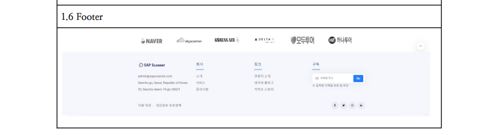
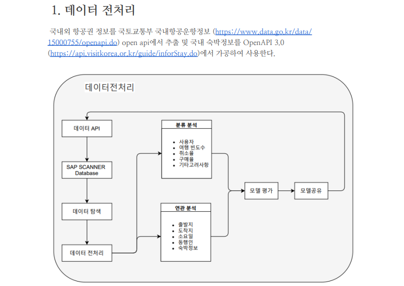

# SAP SCANNER
---
## [Web Project] 

- 요약 : 항공권 예매 및 호텔 예약, 게시판 등 Sky Scanner를 클론코딩 목적으로 작업한 메인프로젝트

- Code Source : https://github.com/bkk91/sapScanner

- 기술 스택: Firebase, ApacheTomcat, Github, Google Drive, Eclipse, JDK, node.js, JavaScript, JQuery, Spring Framework

- 내용 : 비트컴퓨터 국비 교육과정에서 진행하는 웹 최종프로젝트 기획 및 구현.

---
## 프로젝트 플랜 (Project plan)

### 제 1장 웹사이트 개요

 <b> 1. 배경 </b> 

 
 

  

 <b> 2. 핵심가치 & 목표 </b> 

 
 

### 제 2장 환경 분석

 <b> 1. 시장 환경 및 분석 </b> 

 
 
 
 

 <b> 2. SWOT 분석 </b> 

 
 

 <b> 3. 특성 및 차별성 </b> 

 

### 제 3장 프로젝트 구성
  

 <b> 1. 기술스택 </b> 

 
 

  

 <b> 2. 프로젝트 트랙커 </b> 

 
 

### 제 4장 웹페이지 설계

 <b> 1. 메인페이지 및 컨셉 구성 </b> 

 
 

 <b> 2. 기능 페이지 구현 </b> 

 

 
 
 
 
 
 
 
 

### 제 5장 기능 구성

 <b> 1. 핵심 기능 </b> 

 

 
 

 <b> 2. 업무 기능도 </b> 

 
 

### 제 6장 데이터베이스 설계

 <b> 1. 데이터 전처리 </b> 

 
 

 <b> 2. 데이터 테이블 </b> 

 

 
 
 
 
 
 
 
 
 
 
 
 
 
 

 <b> 3. 데이터 흐름도 </b> 

 
 

### 제 7장 부록

 <b> 자료 및 별첨 </b> 

 
 

---

#### 프로젝트 진행 (Progress)

###### 2021.06.01 html Front-end 페이지 업로드 

---
